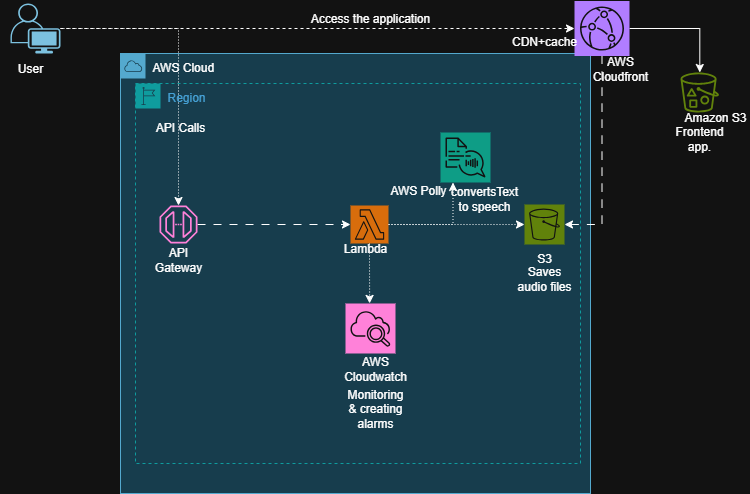

# Text-to-Speech Webpage on AWS (Terraform + Polly + API Gateway)

Using **Terraform** and AWS services, this project sets up a **serverless text-to-speech (TTS) web application**.  
Web pages allow users to enter text, which is then routed to a **API Gateway → Lambda → Amazon Polly** pipeline.  
After creating speech audio (MP3) and storing it in S3, Polly sends the response back for instant replay.

---

## Architecture Overview

- **Amazon S3**  
  - Hosts the static frontend (HTML, CSS, JS).  
  - Stores generated Polly audio files.  

- **Amazon CloudFront**  
  - Distributes the static site globally.  
  - The frontend can be accessed quickly and securely using HTTPS.  

- **AWS Lambda**    
  - Calls Amazon Polly using Python code.  
  - Audio is encoded, saved to S3, and then returned to the frontend in Base64 format.   

- **Amazon Polly**   
  - Supports multiple voices, pitch, and rate.  
  - Transcodes text entered by the user into speech.

- **Amazon API Gateway**  
  - Exposes a `/tts` POST endpoint.  
  - Connects frontend with the Lambda function.  

---

##  Project Structure

```

project-root/
├── main.tf
├── variables.tf
├── output.tf
├── modules/
│   ├── s3_web/         # S3 bucket + website config
│   ├── s3_audio/       # S3 bucket + audio config
│   ├── cloudfront/     # CloudFront distribution
│   ├── lambda/         # Lambda + Python code for Polly
│   └── api_gateway/    # API Gateway REST API + routes
└── static-site/        # HTML, CSS, JS frontend files

````

---
## Architecture Diagram 
 

##  Setup Instructions

### 1. Clone the repository

```bash
git clone https://github.com/priscillaon/polly-project-azubi.git
cd polly-project-azubi
````

### 2. Configure AWS credentials

Ensure your AWS credentials are set locally:

```bash
aws configure
```

Terraform will use these credentials.

### 3. Initialize Terraform

```bash
terraform init
```

### 4. Plan and View Infrastructure

```bash
terraform plan
```

Terraform would show a detailed number, names and descriptions of infrastructure it would provision.

### 5. Deploy Lambda function code

Package the Lambda code:

```bash
cd modules/lambda
zip lambda_function.zip polly_lambda.py
cd ../..
terraform apply
```

Terraform will update Lambda with the zip.
Confirm with `yes` when prompted.
This will create all resources (S3, CloudFront, Lambda, API Gateway).

---

Launch the application

1. The website loads when you open the **CloudFront domain URL**.
2. Click **Play** after entering text, and the API Gateway will send it to Lambda.
3. Lambda returns Base64 after calling **Polly** and storing the audio in S3.
4. The browser automatically plays the audio after decoding it.

---

## Upcoming Enhancements

- Add API Gateway authentication (Cognito, API keys).
CloudFront is used to provide the API under the same domain as the website.
Support for MP3 audio file downloads.
Provide front-end choices for voice, pitch, and pace.

---

## Price & Cleaning

This project makes use of AWS services, which could be expensive:

S3 storage, Lambda, CloudFront, Polly requests, and API Gateway.

To remove every resource:

```bash
terraform destroy
```

---

##  Tools & Versions

- **Terraform** ≥ 1.6
- **AWS CLI** ≥ 2.x
- **Python** 3.11 runtime for Lambda